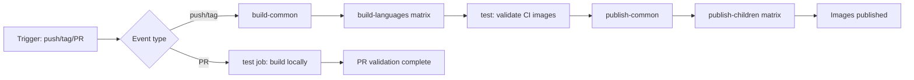

# DevContainer Base Images

A comprehensive set of development container base images with modern tooling, built on Microsoft's DevContainer Ubuntu base image.

## 🐳 Docker-in-Docker Testing Architecture

This project uses a sophisticated testing approach with Docker-in-Docker support:

```
Host Machine
├── DevContainer (Testing Environment)
│   ├── Docker CLI + DevContainer CLI
│   ├── test.sh (uses DevContainer CLI)
│   └── Creates temporary containers to test:
│       ├── TypeScript DevContainer
│       └── Python DevContainer
```

## 🚀 Quick Start

### 1. Open in DevContainer
Open this project in VS Code and use "Dev Containers: Rebuild Container" to start the testing environment.

### 2. Run Tests
```bash
# Test both images using DevContainer CLI
./test.sh

# Test specific image
./test.sh typescript
./test.sh python

# Environment variable approach
TEST_IMAGE=typescript ./test.sh
```

### 3. DevContainer Inception Testing
For advanced testing with nested DevContainers:
```bash
./test-devcontainer-inception.sh
```

## 📦 Available Containers

This repository provides multiple development container configurations, each optimized for specific development workflows:

### Python Development Container (`containers/python/`)
- **🐍 Python Ecosystem**: Python 3.12, Poetry, pip, virtual environments
- **🌐 Node.js Support**: For polyglot development and modern tooling
- **☁️ Cloud**: AWS CLI v2 for cloud development
- **🌐 AI Tools**: Gemini CLI, Claude Code for AI-assisted development
- **🛠️ Modern CLI Tools**: eza, fzf, bat, ripgrep, fd-find, jq
- **🐳 Docker-in-Docker**: Full Docker Engine support
- **🌟 Enhanced Shell**: Starship prompt with Oh My Zsh

### TypeScript Development Container (`containers/typescript/`)
- **🚀 JavaScript/TypeScript Ecosystem**: Node.js LTS, Bun, TypeScript, pnpm, Yarn
- **� Python Support**: Python 3.12 for polyglot development and tooling
- **☁️ Cloud**: AWS CLI v2 for cloud development
- **🌐 AI Tools**: Gemini CLI, Claude Code for AI-assisted development
- **🛠️ Modern CLI Tools**: eza, fzf, bat, ripgrep, fd-find, jq
- **🐳 Docker-in-Docker**: Full Docker Engine support
- **🌟 Enhanced Shell**: Starship prompt with Oh My Zsh

## 🏗️ Building Container Images

Use the provided build script to create Docker images from the devcontainer configurations:

```bash
# Build TypeScript container with default tag
./scripts/build.sh typescript
# or use the convenience wrapper:
./build typescript

# Build Python container with default tag  
./scripts/build.sh python
# or:
./build python

# Build with custom tag
./build typescript my-typescript-image:v1.0
./build python my-python-image:v1.0

# Build and push to registry
PUSH=true ./build typescript
PUSH=true ./build python

# Cross-platform build
PLATFORM=linux/arm64 ./build typescript

# Build without cache
NO_CACHE=true ./build python
```

### Build Script Features
- **✅ DevContainer CLI Integration**: Uses official DevContainer CLI for accurate builds
- **🏗️ Multi-Container Support**: Supports both Python and TypeScript containers
- **🚀 Cross-Platform**: Supports AMD64 and ARM64 architectures
- **📦 Registry Push**: Optional automatic push to container registry
- **🧪 Validation**: Built-in image validation and testing
- **🔧 Flexible Configuration**: Environment variables for customization

## 🧪 Testing Features

### DevContainer CLI Integration
- **Isolated Testing**: Each test runs in a fresh DevContainer environment
- **Comprehensive Validation**: Tests Docker permissions, shell configs, and tool availability
- **Detailed Reporting**: Clear pass/fail indicators with diagnostic information
- **Docker-in-Docker Testing**: Validates nested Docker functionality

### Test Scenarios
- ✅ Tool installation and version checks
- ✅ Docker socket access and permissions
- ✅ Shell configuration and aliases
- ✅ Docker command execution
- ✅ Container build and run capabilities
- ✅ AI tool availability

## 🔧 Development

### Project Structure
The repository is organized with separate directories for each container type:

```
containers/
├── python/
│   ├── devcontainer.json       # Python container configuration
│   └── Dockerfile              # Python container image definition
└── typescript/
    ├── devcontainer.json       # TypeScript container configuration
    └── Dockerfile              # TypeScript container image definition

scripts/
├── build.sh                    # Multi-container build script
└── test.sh                     # Comprehensive testing script

build                           # Convenience wrapper for scripts/build.sh
test                            # Convenience wrapper for scripts/test.sh
.devcontainer/                  # Testing environment configuration
```

### Environment Setup
The testing environment is a lightweight DevContainer with:
- Docker-in-Docker feature enabled
- Node.js LTS for DevContainer CLI
- Proper Docker socket mounting

### Test Structure
```bash
scripts/
├── test.sh                     # Main test script using DevContainer CLI
└── build.sh                   # Container build script

.devcontainer/
├── devcontainer.json           # Testing environment configuration
└── setup.sh                   # Environment setup script
test-devcontainer-inception.sh  # Advanced nested testing
```

## 🐳 Docker-in-Docker Architecture

The testing setup uses proper DevContainer features for reliable Docker-in-Docker:

```json
{
    "features": {
        "ghcr.io/devcontainers/features/docker-in-docker:2": {
            "version": "latest",
            "enableNonRootDocker": "true"
        }
    },
    "privileged": true,
    "mounts": [
        "source=/var/run/docker.sock,target=/var/run/docker.sock,type=bind"
    ]
}
```

## 🎯 Benefits

1. **🔒 Isolated Testing**: No pollution of host environment
2. **🧪 Reproducible**: Same environment every time
3. **🚀 Fast Iteration**: Quick test cycles with DevContainer CLI
4. **📊 Comprehensive**: Tests all aspects of container functionality
5. **🛡️ Reliable**: Uses official DevContainer features for DinD

## 🚀 Usage Examples

```bash
# Build containers (using convenience wrappers)
./build typescript
./build python

# Or use the full script paths
./scripts/build.sh typescript
./scripts/build.sh python

# Build with custom tags
./build typescript my-ts-dev:latest
./build python my-py-dev:latest

# Run comprehensive tests
./test
# or:
./scripts/test.sh

# Test specific containers
./test typescript
./test python

# Environment variable approach for testing
TEST_IMAGE=typescript ./test
TEST_IMAGE=python ./test
```

This approach provides robust testing of DevContainer configurations with proper Docker-in-Docker support! 🎉

## Available Images

### Python Development Environment
- **Image**: `ghcr.io/get2knowio/devcontainer-python-base:latest`
- **Focus**: Python development with modern tooling
- **Key Tools**: Python 3.12, Poetry, pip, AWS CLI, AI development tools

### TypeScript/Node.js Development Environment  
- **Image**: `ghcr.io/get2knowio/devcontainer-typescript-base:latest`
- **Focus**: TypeScript/JavaScript development with modern runtime
- **Key Tools**: Node.js LTS, Bun, TypeScript, npm/yarn/pnpm, AWS CLI, AI development tools

## Common Features
- Built on the official Microsoft Dev Containers base image for stability and compatibility.
- Pre-configured non-root user (`vscode`) with sudo access.
- Supports Visual Studio Code customizations (extensions, settings, etc.).
- Multi-platform compatibility (linux/amd64, linux/arm64).
- Modern CLI tools (eza, fzf, bat, ripgrep, fd, jq).
- Starship prompt for enhanced shell experience.
- AWS CLI v2 for cloud development.
- AI-powered development tools (Gemini CLI, Claude Code).

## How to Use
To leverage these base images in your own project, you can create a `.devcontainer` configuration in your repository. Below are example configurations for each image:

### Python Development Container
```json
{
  "name": "Python Dev Container",
  "image": "ghcr.io/get2knowio/devcontainer-python-base:latest",
  "remoteUser": "vscode",
  "features": {},
  "postCreateCommand": "poetry install",
  "customizations": {
    "vscode": {
      "extensions": [
        "ms-python.python",
        "ms-python.vscode-pylance"
      ]
    }
  }
}
```

### TypeScript/Node.js Development Container
```json
{
  "name": "TypeScript Dev Container",
  "image": "ghcr.io/get2knowio/devcontainer-typescript-base:latest",
  "remoteUser": "vscode",
  "features": {},
  "postCreateCommand": "npm install",
  "customizations": {
    "vscode": {
      "extensions": [
        "ms-vscode.vscode-typescript-next",
        "esbenp.prettier-vscode",
        "dbaeumer.vscode-eslint"
      ]
    }
  }
}
```

## User Expectations
- **Docker Installed**: Ensure Docker is installed and running on your machine.
- **VS Code Dev Containers Extension**: Install the [Dev Containers extension](https://marketplace.visualstudio.com/items?itemName=ms-vscode-remote.remote-containers) in Visual Studio Code.

### For Python Development
- **Poetry**: The Python image assumes you are using [Poetry](https://python-poetry.org/) for dependency management. Ensure your project is configured with a `pyproject.toml` file.

### For TypeScript Development  
- **Package Manager**: The TypeScript image supports npm, yarn, pnpm, and Bun. Choose your preferred package manager and ensure your project has the appropriate configuration file (`package.json`, `yarn.lock`, `pnpm-lock.yaml`, etc.).

## Local Testing
To test the images locally before pushing changes, you can use the provided test script:

```bash
# Test both images (build and test) - using convenience wrapper
./test

# Test only the Python image
./test python

# Test only the TypeScript image  
./test typescript

# Or use the full script path
./scripts/test.sh

# Test a specific pre-built image
./test ghcr.io/get2knowio/devcontainer-python-base:latest
./test ghcr.io/get2knowio/devcontainer-typescript-base:latest
```

This script will:
- Build the Docker images locally (when no specific image is provided)
- Run comprehensive tests to verify each image works correctly
- Check that all essential tools and dependencies are properly installed
- Provide detailed output for debugging any issues

## Build and Push Workflow
This repository includes a GitHub Actions workflow (`.github/workflows/docker-build-push.yml`) to automatically build and push both Docker images to GHCR on changes to the `main` or `develop` branches, or when a new tag is created. The workflow uses a matrix strategy to build both Python and TypeScript variants in parallel.

### CI Process (diagram)



**Detailed flow explanation:**

**1. Trigger Events:**
- **Push to main/develop**: Runs optimized build pipeline (build-common → build-languages → test → publish-common → publish-children)
- **Tag creation (v*)**: Runs same optimized pipeline with version-specific tagging
- **Pull Request**: Runs only the `test` job with local builds and PR-specific validation steps

**2. Build-Common Job (push/tag only):**
- **Setup**: Installs DevContainer CLI, sets up QEMU and Docker Buildx, logs into GHCR
- **Purpose**: Builds the base common image that python/typescript extend from
- **Process**: Builds and pushes `devcontainer-base-common` with `ci-{SHA}` tag
- **Multi-platform**: Uses `platform: linux/amd64,linux/arm64` via DevContainers CI action
- **Output**: Provides image references and CI tag for dependent jobs

**3. Build-Languages Job (push/tag only):**
- **Depends on**: `build-common` job completion
- **Matrix strategy**: Runs in parallel for `python` and `typescript` containers (2x parallelization)
- **Setup**: Each matrix job sets up QEMU and Docker Buildx for cross-architecture builds
- **Purpose**: Builds language-specific images that depend on the common base
- **Multi-platform**: Each matrix job builds both amd64 and arm64 architectures simultaneously
- **Efficiency**: Parallelizes the heavy building work instead of lightweight retagging

**4. Test Job:**
- **Depends on**: Both `build-common` and `build-languages` completion (for push/tag) or runs standalone (for PR)
- **For Push/Tag events**:
  - Tests the newly built CI images with multi-arch manifest lists
  - Uses pre-built images from previous steps (no building, just validation)
- **For Pull Request events**:
  - Builds images locally with full cross-platform setup
  - Runs comprehensive validation tests to ensure PRs don't break functionality

**5. Publish-Common Job (push/tag only):**
- **Depends on**: `test` job completion
- **Setup**: Sets up Docker Buildx (no QEMU needed - just retagging existing manifest lists)
- **Purpose**: Promotes the CI common image to canonical tags (latest, version tags)
- **Process**: Uses `docker buildx imagetools` to retag `ci-{SHA}` → `latest`, `main`, `v1.2.3`, etc.
- **Multi-platform handling**: Promotes the entire manifest list (both amd64 and arm64 images together)

**6. Publish-Children Job (push/tag only):**
- **Depends on**: `publish-common` job completion
- **Setup**: Each matrix job sets up Docker Buildx (no QEMU needed - just retagging)
- **Matrix strategy**: Runs in parallel for `python` and `typescript` containers
- **Purpose**: Promotes language-specific CI images to their canonical tags
- **Process**: Similar retagging process for `devcontainer-python-base` and `devcontainer-typescript-base`
- **Multi-platform handling**: Each matrix job promotes its own multi-arch manifest list

**Key Optimizations:**
- **Build Parallelization**: Heavy building work (steps 2-3) is parallelized, not lightweight retagging (steps 5-6)
- **Dependency Management**: Common base is built first, then language variants can build in parallel
- **Resource Efficiency**: QEMU setup only where needed (building), not for simple image retagging
- **Matrix Strategy**: Used for actual parallel work (2 language builds) rather than sequential retagging

**Multi-Platform Architecture Support:**
- **Target Platforms**: `linux/amd64` and `linux/arm64` (supports both Intel/AMD and Apple Silicon)
- **Build Strategy**: Uses Docker Buildx with QEMU emulation for cross-compilation (in build jobs)
- **Manifest Lists**: Each published image is actually a manifest list containing both architectures
- **DevContainers CI Integration**: The `devcontainers/ci@v0.3` action handles multi-platform builds automatically
- **Promotion Process**: `docker buildx imagetools` preserves and copies the multi-arch manifest when retagging (no building/QEMU needed)
- **Runtime**: Docker automatically pulls the correct architecture variant based on the host platform
